### 功能说明

#### 程序流程图

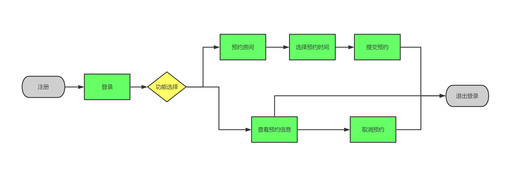

### 一、程序配置

#### 1.1 软件使用及框架

编程平台：IntelliJ IDEA

前端框架：Bootstrap 4.3.1

后端框架：springMVC

js文件：javascript原生语言及jquery 3.2.1

服务器：tomcat 9.0.64

数据库:oracle11g 11.2.0.1.0

#### 1.2 数据库配置

###### db.properties

```properties
jdbc.driver=oracle.jdbc.OracleDriver
jdbc.url=jdbc:oracle:thin:@localhost:1521:orcl
jdbc.username=zth
jdbc.password=123456
```

#### 1.3 web.xml配置

```xml
<web-app>
  <display-name>Archetype Created Web Application</display-name>
  <context-param>
    <param-name>contextConfigLocation</param-name>
    <param-value>classpath:applicationContext.xml</param-value>
  </context-param>

  <!--    3 使用spring提供的编码过滤器-->
  <filter>
    <filter-name>characterEncodingFilter</filter-name>
    <filter-class>org.springframework.web.filter.CharacterEncodingFilter</filter-class>
    <init-param>
      <param-name>encoding</param-name>
      <param-value>UTF-8</param-value>
    </init-param>
    <init-param>
      <param-name>forceRequestEncoding</param-name>
      <param-value>true</param-value>
    </init-param>
    <init-param>
      <param-name>forceResponseEncoding</param-name>
      <param-value>true</param-value>
    </init-param>
  </filter>


  <!--    配置REST风格的转换-->
  <filter>
    <filter-name>hiddenHttpMethodFilter</filter-name>
    <filter-class>org.springframework.web.filter.HiddenHttpMethodFilter</filter-class>
  </filter>
  <filter>
    <filter-name>httpPutFormContentFilter</filter-name>
    <filter-class>org.springframework.web.filter.HttpPutFormContentFilter</filter-class>
  </filter>
  <!--    编码过滤器映射-->
  <filter-mapping>
    <filter-name>characterEncodingFilter</filter-name>
    <url-pattern>/*</url-pattern>
  </filter-mapping>
  <!--    REST过滤器映射-->
  <filter-mapping>
    <filter-name>hiddenHttpMethodFilter</filter-name>
    <url-pattern>/*</url-pattern>
  </filter-mapping>
  <filter-mapping>
    <filter-name>httpPutFormContentFilter</filter-name>
    <url-pattern>/*</url-pattern>
  </filter-mapping>
  <!--    2 配置在web容器启动时,使spring的文件可以加载-->
  <listener>
    <listener-class>org.springframework.web.context.ContextLoaderListener</listener-class>
  </listener>

  <!--  1 配置前端控制器,以后的用户访问都交给DispatcherServlet处理-->
  <servlet>
    <servlet-name>dispatcherServlet</servlet-name>
    <servlet-class>org.springframework.web.servlet.DispatcherServlet</servlet-class>
    <init-param>
      <param-name>contextConfigLocation</param-name>
      <param-value>classpath:springmvc.xml</param-value>
    </init-param>
    <!--    启动服务器,创建该serlvet时即加载-->
    <load-on-startup>1</load-on-startup>
  </servlet>


  <servlet-mapping>
    <servlet-name>dispatcherServlet</servlet-name>
    <!--    所有的请求都交给该servlet处理-->
    <url-pattern>/</url-pattern>
  </servlet-mapping>
</web-app>

```

#### 1.4 后端springMVC配置

##### 1.4.1 依赖导入

```java

      <artifactId>mybatis</artifactId>
      <version>3.5.10</version>
          
      <artifactId>ojdbc6</artifactId>
      <version>11.2.0.1.0</version>
          
      <artifactId>jackson-databind</artifactId>
      <version>2.10.0</version>
    <!--        导入spring的依赖-->
      <artifactId>spring-context</artifactId>
      <version>${spring.version}</version>
          
      <artifactId>spring-aop</artifactId>
      <version>${spring.version}</version>
          
      <artifactId>spring-core</artifactId>
      <version>${spring.version}</version>

      <artifactId>spring-beans</artifactId>
      <version>${spring.version}</version>

      <artifactId>spring-expression</artifactId>
      <version>${spring.version}</version>
    <!--        spring web 模块的包-->
      <artifactId>spring-web</artifactId>
      <version>${spring.version}</version>

      <artifactId>spring-webmvc</artifactId>
      <version>${spring.version}</version>
    <!--        织入包-->
      <artifactId>spring-aspects</artifactId>
      <version>${spring.version}</version>
          
      <artifactId>aspectjweaver</artifactId>
      <version>1.6.12</version>
    <!--        spring整合mybatis-->
      <artifactId>mybatis-spring</artifactId>
      <version>1.3.1</version>
    <!--        数据库连接池-->
      <artifactId>c3p0</artifactId>
      <version>0.9.1.2</version>

      <artifactId>mybatis</artifactId>
      <version>3.4.5</version>
    <!--        mybatis的逆向工程-->
      <artifactId>mybatis-generator-core</artifactId>
      <version>1.3.7</version>
```

##### 1.4.2 mybatis配置

```xml
<configuration>
    <properties resource="db.properties"></properties>
    <settings>
<!--        配置驼峰映射-->
        <setting name="mapUnderscoreToCamelCase" value="true"/>
            <!--   设置mybatis输出日志   STDOUT_LOGGING把日志输出到控制台  -->
        <setting name="logImpl" value="STDOUT_LOGGING" />
    </settings>
<!--   配置别名映射-->
    <typeAliases>
<!--        默认情况下别名是类名的小写开头-->
        <package name="file.zhang.entity"/>
    </typeAliases>
</configuration>
```

##### 1.4.3 mybatis 托管数据库，Mapper及实体类生成配置

```xml
<generatorConfiguration>
    <context id="oracle11g" targetRuntime="MyBatis3">
        <commentGenerator>
            <property name="suppressAllComments" value="true"/>
        </commentGenerator>

<!--        数据库连接-->
        <jdbcConnection driverClass="oracle.jdbc.OracleDriver"
                        connectionURL="jdbc:oracle:thin:@localhost:1521:orcl" userId="zth" password="123456" />
<!--    指定javaBean的生成位置-->
        <javaModelGenerator targetPackage="file.zhang.entity" targetProject="./src/main/java">
            <property name="enableSubPackages" value="true"/>
        </javaModelGenerator>
<!--        指定mapper的接口文件的位置-->
        <sqlMapGenerator targetPackage="file.zhang.dao" targetProject="./src/main/java">
            <property name="enableSubPackages" value="true"/>
        </sqlMapGenerator>

        <javaClientGenerator type="XMLMAPPER" targetPackage="file.zhang.dao" targetProject="./src/main/java">
            <property name="enableSubPackages" value="true"/>
        </javaClientGenerator>
<!--        指定数据表的生成策略-->
        <table tableName="GUEST_INFO" domainObjectName="Guest_info" />
        <table tableName="RESERVE_INFO" domainObjectName="Reserve_info" />
        <table tableName="ROOM_INFO" domainObjectName="Room_info" />
    </context>
</generatorConfiguration>
```

##### 1.4.4 springMVC 配置

```xml
   <!--    1 组件扫描,因为service层和持久层已经由spring负责管理,所以springmvc仅需要扫描管理Controller即可-->
    <context:component-scan base-package="file.zhang">
        <context:include-filter type="annotation" expression="org.springframework.stereotype.Controller"/>
        <context:exclude-filter type="annotation" expression="org.springframework.stereotype.Service"/>
        <context:exclude-filter type="annotation" expression="org.springframework.stereotype.Repository"/>
    </context:component-scan>
    <!--    3 开启springMVC的注解驱动-->
    <mvc:annotation-driven/>
    <!--    4 配置静态资源过滤-->
    <!--    <mvc:default-servlet-handler />-->
    <mvc:resources mapping="/css/**" location="/css/"/>
    <mvc:resources mapping="/js/**" location="/js/"/>
    <mvc:resources mapping="/images/**" location="/images/"/>
```


##### 1.4.5 spring整合各依赖及注册注解

```xml
<!--    </bean>-->
    <!--1 开启注解的扫描,使spring能够自动扫描到组件纳入到IOC容器中-->
    <context:component-scan base-package="file.zhang">
        <!--        将service和持久层的bean交给spring管理,表现层的bean交给springmvc管理-->
        <context:include-filter type="annotation" expression="org.springframework.stereotype.Service"/>
        <context:include-filter type="annotation" expression="org.springframework.stereotype.Repository"/>
        <context:exclude-filter type="annotation" expression="org.springframework.stereotype.Controller"/>
    </context:component-scan>
    <!--    2 使用spring整合mybatis-->
    <!--    2.0 引入外部的数据连接信息-->
    <context:property-placeholder location="classpath:db.properties"></context:property-placeholder>
    <!--    2.1 配置连接池(dbcp,c3p0,durid),通过连接池管理数据库的连接,可以保留mybatis的配置文件,做一些spring配置不太方便的工作-->
    <bean id="dataSource" class="com.mchange.v2.c3p0.ComboPooledDataSource">
        <property name="driverClass" value="${jdbc.driver}"></property>
        <property name="jdbcUrl"
                  value="${jdbc.url}"></property>
        <property name="user" value="${jdbc.username}"></property>
        <property name="password" value="${jdbc.password}"></property>
    </bean>
    <!--    2.2 配置SqlSessionFactory工厂,使用的数据源就应该是 c3p0提供的数据源-->
    <bean id="sqlSessionFactory" class="org.mybatis.spring.SqlSessionFactoryBean">
        <property name="dataSource" ref="dataSource"></property>
        <!--        引入独立的mybatis的配置文件,将一些在spring中不易的配置信息放在mybatis中-->
        <property name="configLocation" value="classpath:mybatis-config.xml"></property>

    </bean>
    <!--    2.3 配置动态代理指定接口-->
    <bean id="mapperScannerConfigurer" class="org.mybatis.spring.mapper.MapperScannerConfigurer">
        <property name="basePackage" value="file.zhang.dao"></property>
    </bean>
    <!--    3 配置spring框架的声明式事务-->
    <!--    3.1 配置事务管理器-->
    <bean id="transactionManager" class="org.springframework.jdbc.datasource.DataSourceTransactionManager">
        <property name="dataSource" ref="dataSource"></property>
    </bean>
    <!--    3.2 配置事务的增强-->
    <tx:advice transaction-manager="transactionManager" id="transactionInterceptor">
        <tx:attributes>
            <!--            所有的方法都是事务方法-->
            <tx:method name="*" isolation="DEFAULT"/>
            <!--            对于查询方法,仅只读-->
            <tx:method name="select*" read-only="true"/>
        </tx:attributes>
    </tx:advice>
    <!--    3.3 配置AOP,事务如何切入(可以是注解的方式,本案例使用配置文件)-->
    <aop:config>
        <aop:advisor advice-ref="transactionInterceptor"
                     pointcut="execution(* file.zhang.service.impl.*ServiceImpl.*(..))"/>
    </aop:config>

<!--    上传文件-->
    <bean id="multipartResolver" class="org.springframework.web.multipart.commons.CommonsMultipartResolver">
        <property name="defaultEncoding" value="UTF-8"></property>
        <property name="maxUploadSize" value="10000000"></property>
    </bean>
</beans>
```

### 二、前端功能点

#### 2.1 html页面功能点

##### 2.1.1 横向导航栏


##### 2.1.2 模态框

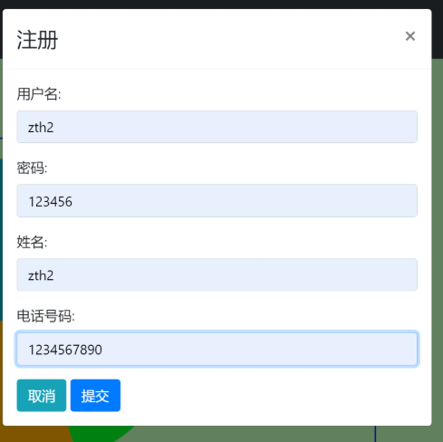

##### 2.1.3 左侧导航栏

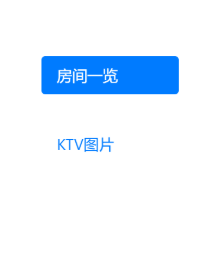

##### 2.1.4 下拉框

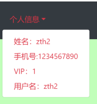

##### 2.1.5 鼠标悬停状态表格

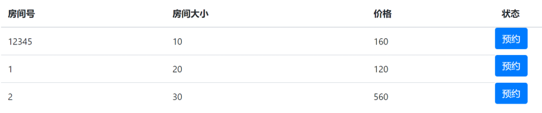

##### 2.1.6 输入框及按钮组


#### 2.2 js文件功能点

##### 2.2.1 ajax请求

```javascript
<--设置路径、发送方式、数据-->
$.ajax({
            url: "http://localhost:8888/guest/autologin",
            method: "GET",
            data={}
            error: function (xhr, status, error) {
                console.log(status);
            },
            success: function (result, status, xhr) {
                console.log(result);
                if (result.statusCode == "200") {
                    alert(result.message);
                } else {
                    alert(result.message);
                }
            }});

```

##### 2.2.2 输入检测

```javascript
function checkinformation() {
        var user_name=form1.uname.value;
            var user_pwd=form1.pwd.value;
            if((user_name=="")||(user_name==null)){
                $("#username-feedback").css("visibility", "visible");
                return false;
            }
            else if((user_pwd=="")||(user_pwd==null)){
                $("#password-feedback").css("visibility", "visible");
                return false;}
            else {
                return true;
            }
        }
```

##### 2.2.3 模态框登录

```javascript
<--登陆后的界面设置-->
                    if (result.statusCode == "200") {
                        $("#item1").text("个人信息").toggleClass("text-danger");
                        $("#item2").text("姓名："+result.dataZone.guest.name).toggleClass("text-danger");
                        $("#item3").text("手机号:"+result.dataZone.guest.phone).toggleClass("text-danger");
                        $("#item4").text("VIP："+result.dataZone.guest.vip).toggleClass("text-danger");
                        $("#item5").text("用户名："+result.dataZone.guest.id).toggleClass("text-danger");
                        $("#function_opt").css("visibility", "visible");
                        $("#navbardrop5").css("visibility", "visible");
                        $("#login_btn").modal('hide');
                        $("#register_btn").modal('hide');
                        $("#register_button").css("visibility", "hidden");
                        $("#login_button").css("visibility", "hidden");
                        $("#logout_button").css("visibility", "visible");
                        alert(result.message);
                    } else {
                        alert(result.message);
                    }
```

##### 2.2.4 动态生成预约表格的内容，包括获取所有的房间信息

```javascript
<--创建html标签并进行填充-->
if (result.statusCode == "200") {
                    $("#book_form").html("");
                    var otbody=document.getElementsByTagName("tbody")[0];
                    var roomlist=result.dataZone.roomlist;
                    console.log(roomlist[0]);
                   for(room in roomlist){
                       var otr = document.createElement("tr");
                       var otd1= document.createElement("td");
                       var otd2= document.createElement("td");
                       var otd3= document.createElement("td");
                       var otd4= document.createElement("button");
                       otd4.setAttribute("class","btn btn-primary");                     otd4.setAttribute("onclick","reserve('"+result.dataZone.roomlist[room].id+"')");
                       otd4.setAttribute("data-toggle","modal");
                       otd4.setAttribute("data-target","#reserve_btn")
                       otd1.innerText=result.dataZone.roomlist[room].id;
                       otd2.innerText=result.dataZone.roomlist[room].rsize;
                       otd3.innerText=result.dataZone.roomlist[room].price;
                       otd4.innerText="预约";
                       otr.appendChild(otd1);
                       otr.appendChild(otd2);
                       otr.appendChild(otd3);
                       otr.appendChild(otd4);
                       otbody.appendChild(otr);
                   }
```

##### 2.2.5 动态获取对应房间的空闲时间段

```javascript
<--获取对应房间id,并查询该房间空闲时间段，将非空闲时间段设置为不可选中-->
            if (result.statusCode == "200") {
                document.getElementById("room_id").innerText=number;
                var freetime=result.dataZone.free;
                console.log(freetime);
                var buttons=document.getElementsByClassName("form-check-input");
                // buttons[0].setAttribute("disabled","true");
                // buttons[1].setAttribute("disabled","true");
                for(free in freetime){
                    buttons[free].removeAttribute("disabled");
                    buttons[free].checked=false;
                    if(freetime[free]=='1'){
                        buttons[free].setAttribute("disabled","true");
                   }
                }
```

#### 2.3 CSS文件功能点--各选择器

```css
div.col-8 div:nth-child(1){    
    background: #c1ffba;
}
#navigation li{
    margin-top: 2em;
}
```

### 三、后端功能点

#### 3.1 Service接口类

```java
public interface GuestService {
    public Guest_infoWithBLOBs getGuest(String guest_id);
    public void insertGuest(Guest_infoWithBLOBs guest);
}
```

#### 3.2 ServiceImpl 实现类

##### 3.2.1 GuestServiceImpl类

```java
    <--根据客户id获得客户信息-->
    @Override
    public Guest_infoWithBLOBs getGuest(String guest_id) {

        return guest_infoMapper.selectByPrimaryKey(guest_id);
    }
   <--插入客户信息-->
    @Override
    public void insertGuest(Guest_infoWithBLOBs guest_info) {
          this.guest_infoMapper.insert(guest_info);
    }

}
```

##### 3.2.2 ReserveServiceImpl类

```java
    <--根据房间id查找预约信息-->
    @Override
    public List<Reserve_info> findReserve(String room_id) {
        Reserve_infoExample reserve_infoExample=new Reserve_infoExample(Reserve_info.class);
        Reserve_infoExample.Criteria criteria=reserve_infoExample.createCriteria();
        criteria.andRIdEqualTo(room_id);
        List<Reserve_info> reserve_infoList = reserve_infoMapper.selectByExample(reserve_infoExample);
        return reserve_infoList;
    }
    <--插入房间预约信息-->
    @Override
    public void insertReserve(Reserve_info reserve_info) {
     this.reserve_infoMapper.insert(reserve_info);
    }
    <根据客人id获得对应预约信息-->
    @Override
    public List<Reserve_info> getReserve(String guest_id) {
        Reserve_infoExample reserve_infoExample=new Reserve_infoExample(Reserve_info.class);
        Reserve_infoExample.Criteria criteria=reserve_infoExample.createCriteria();
        criteria.andGIdEqualTo(guest_id);
        List<Reserve_info> reserve_infoList = reserve_infoMapper.selectByExample(reserve_infoExample);
        return reserve_infoList;
    }
    <--删除预约信息-->
    @Override
    public void deleteReserve(String id) {
        System.out.println(id);
        this.reserve_infoMapper.deleteByPrimaryKey(id);
    }
```

##### 3.2.3 RoomServiceImpl类

```java
    <--获得所有房间的信息-->
    @Override
    public List<Room_info> getAllRoom() {
        return room_infoMapper.selectByExample(null);
    }
    <--获得某个房间的信息-->
    @Override
    public Room_info getRoom(String room_id) {
        return room_infoMapper.selectByPrimaryKey(room_id);
    }

```

#### 3.3 Controller类——后端功能点说明

##### 3.3.1 客户登录

```java
 @RequestMapping(value = "/get",method = RequestMethod.GET)
    public MessageAndData qetguestbyId(String username, String password){
        /*根据客户id查询密码，查询成功记录客户，以实现自动登录*/
    }
```

##### 3.3.2 已登录后自动登录

```java
@RequestMapping(value = "/autologin",method = RequestMethod.GET)
    public MessageAndData autologin(HttpSession session){
       /*如果该用户未退出登录，则返回客户信息，以自动登录*/
    }
```

##### 3.3.3 登出

```java
 @RequestMapping(value = "/logout",method = RequestMethod.GET)
    public MessageAndData logoutguest() {
        /*退出登录，删除客户自动登录信息*/
    }
```

##### 3.3.4  查询客户已预约订单信息

```java
 @RequestMapping(value = "/all",method = RequestMethod.GET)
    public MessageAndData all() {
       /*返回目前客户预约订单*/
    }
```

##### 3.3.5 查询房间空闲时间

```java
 @RequestMapping(value = "/free",method = RequestMethod.GET)
    public MessageAndData qetreservebyRId(String room_id){
       /*返回点击房间的空闲时间段*/
        }
```

##### 3.3.6 预约信息插入

```java
@RequestMapping(value = "/insert",method = RequestMethod.GET)
    public MessageAndData insert(String guest_id,String room_id,String reserve_flag){
       /*根据客户id、房间id、预约时间段插入预约信息*/
    }
```

##### 3.3.7 删除预约记录

```java
@RequestMapping(value = "/delete",method = RequestMethod.GET)
    public MessageAndData insert(String id){
       /*删除点击的预约信息*/
    }
```

##### 3.3.8 获取所有房间信息

```java
@RequestMapping(value = "/all",method = RequestMethod.GET)
    public MessageAndData qetallroom(String search){
       /*返回所有房间的信息*/
}
```

## 测试及实现界面截图

### 四、页面设计及使用说明

#### 4.1 起始页面

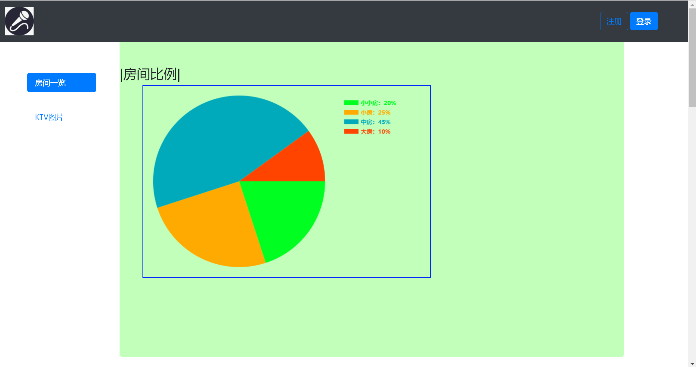


#### 4.2 注册

使用zth2作为演示

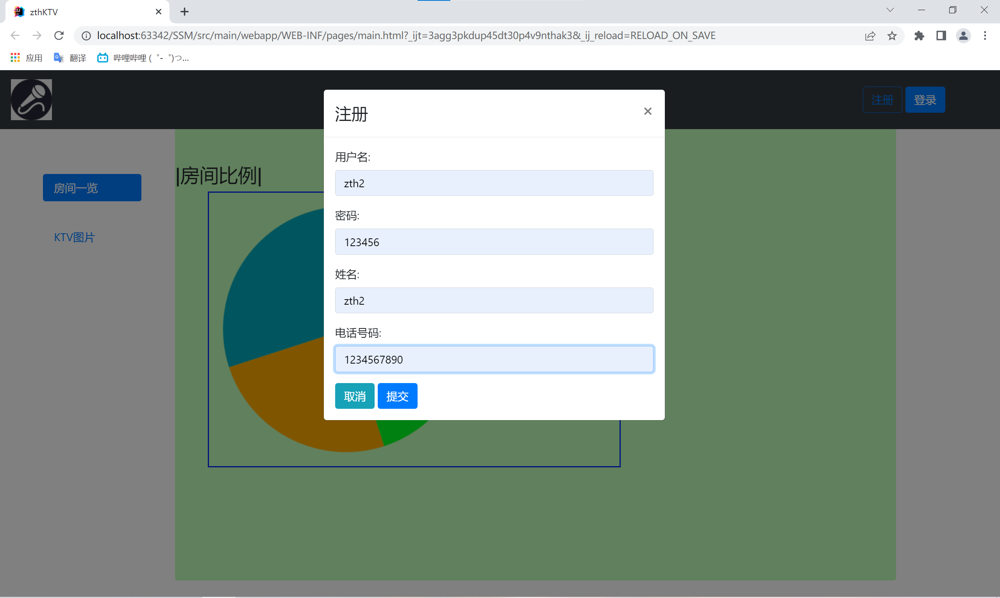


#### 4.3 登录

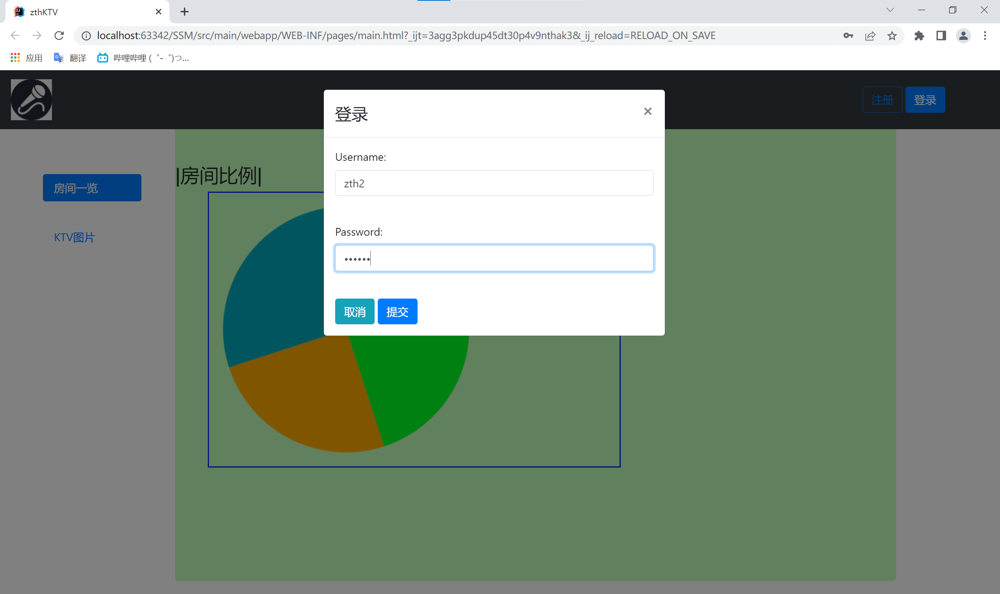


#### 4.4 主页面

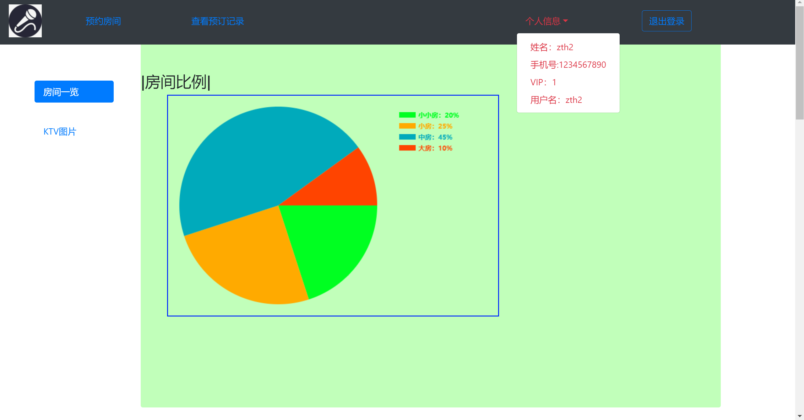

#### 4.5 预约房间主页面

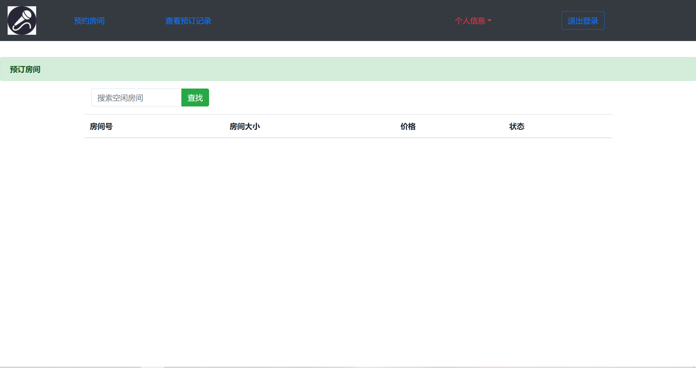


#### 4.6 空白查找房间

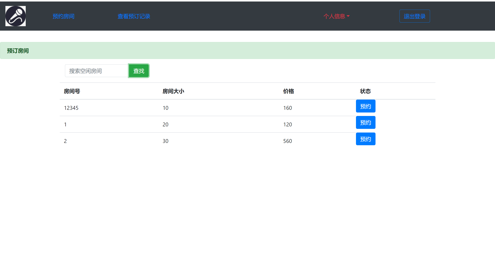

#### 4.7 输入查找房间

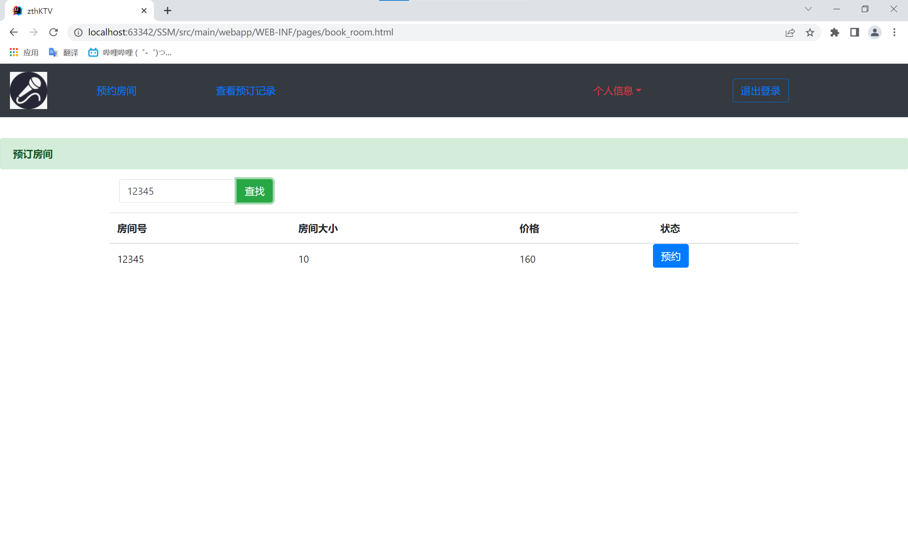

#### 4.8 预约房间

无法选择的复选框代表已经被人占用。

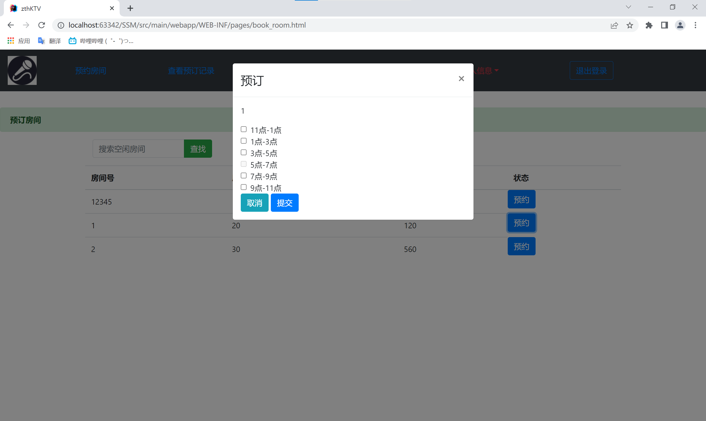

选择1号房间7-11点的框


再选择2号房间5-7点的框

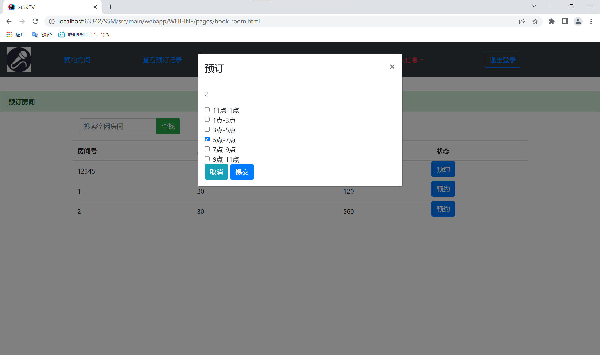


#### 4.9 查看预约信息

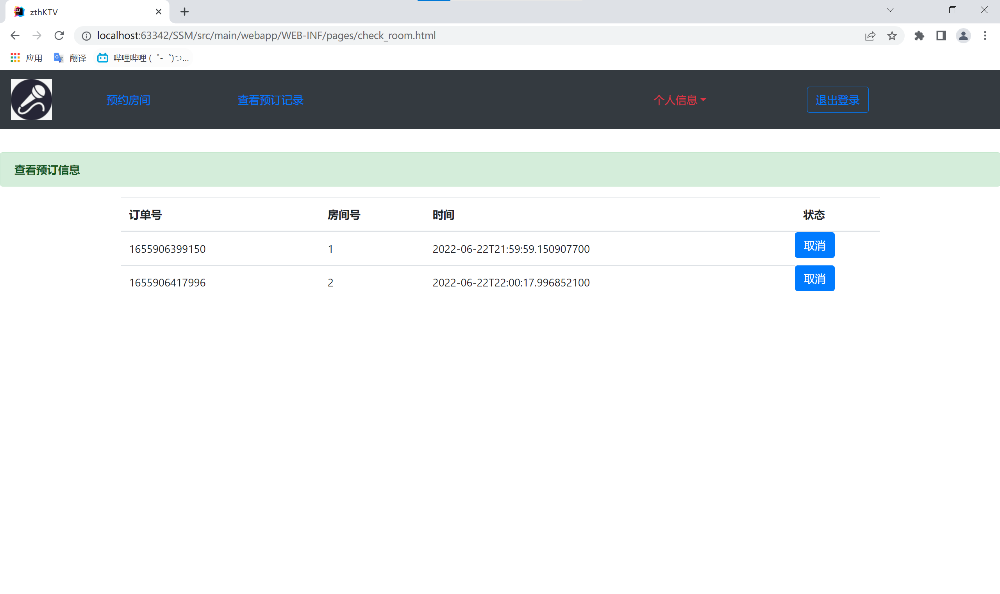

#### 4.10 进行预约取消

取消1号房间的预约

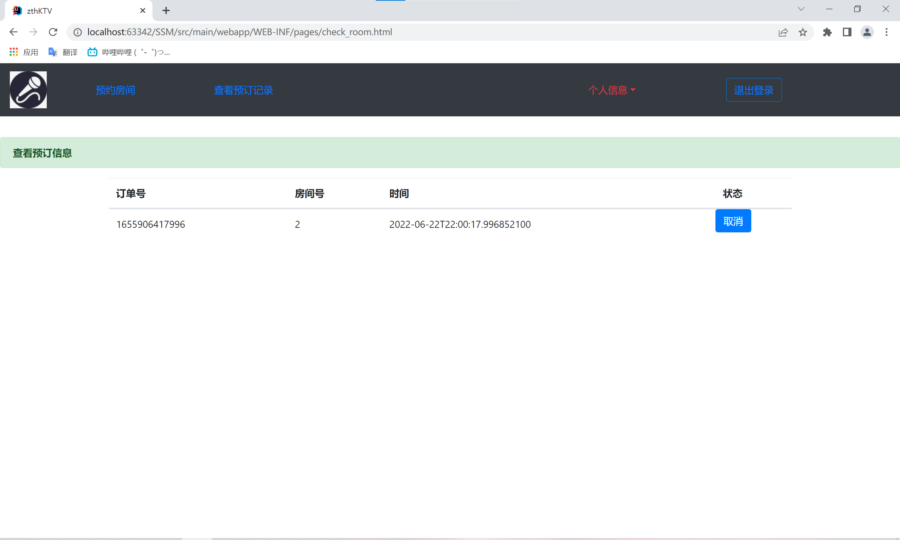


#### 4.11 查看数据库中的2号房间预约

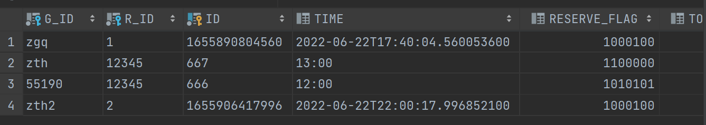


所有功能均正常运行，演示完毕。


### 五、心得体会

​        这次软件开发实践课程我负责的是B/S部分。在完成KTV预约系统的过程中，我加强了对前端html代码，css选择器，js，jquery的熟练程度，通过学习前端内容，我了解到了网页的组成，布局和控制是如何完成的。后端使用的SpringMVC框架为开发后端提供了很大的便利，通过mybatis组件，我不再需要对数据库表和实体类进行一一映射，只需要通过mybatis逆向工程就可以自动生成所有的实体类和数据库的增删改查功能。与学校学习的内容相比，在实践中运用的软件与框架都更加高效便捷，但学校学校的内容作为运用软件和框架的基础，能够使我们能够更快地理解如何使用软件和框架。

​       在这次课程中，小组内成员所有的交流均需要通过线上方式完成，在合作过程中，线上方式相比线下方式有不少问题需要解决，比如交流问题，积极性问题等，我们通过各种方式，克服了线上方式的问题，成功的完成了本次的项目。